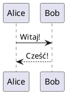

# Dokumentacja i Diagramy UML

## 📚 Zawartość

Folder `doc/` zawiera kompleksową dokumentację projektu:

1. **PROJECT_DOCUMENTATION.md** - Pełna dokumentacja techniczna
2. **diagrams.puml** - Diagramy UML w formacie PlantUML
3. **generate_diagrams.sh** - Skrypt do generowania diagramów

## 🎨 Diagramy UML

### Dostępne diagramy:

1. **Architecture Diagram** - Ogólna architektura systemu
2. **Sequence Diagrams**:
   - Login flow
   - Knowledge test (10 questions)
   - View rankings
   - Server information request
3. **Class Diagrams**:
   - Server components
   - Client components
4. **State Diagrams**:
   - Client application states
   - Server daemon states
5. **Component Diagram** - TLV Protocol Layer
6. **Deployment Diagram** - Production setup

## 🛠️ Generowanie diagramów

### Wymagania:

```bash
# Ubuntu/Debian
sudo apt install plantuml graphviz

# Opcjonalnie: Pandoc dla dokumentacji PDF/HTML
sudo apt install pandoc texlive-xetex
```

### Generowanie:

```bash
cd doc/
./generate_diagrams.sh
```

To wygeneruje:
- Diagramy PNG w `diagrams_output/`
- Diagramy SVG w `diagrams_output/`
- PDF dokumentacji (jeśli zainstalowany Pandoc)
- HTML dokumentacji (jeśli zainstalowany Pandoc)

### Ręczne generowanie:

```bash
# Tylko diagramy PNG
plantuml -tpng diagrams.puml

# Tylko diagramy SVG (skalowalne)
plantuml -tsvg diagrams.puml

# PDF z dokumentacji
pandoc PROJECT_DOCUMENTATION.md -o documentation.pdf \
    --pdf-engine=xelatex --toc

# HTML z dokumentacji
pandoc PROJECT_DOCUMENTATION.md -o documentation.html \
    --standalone --toc
```

## 📖 Dokumentacja w różnych formatach

### Markdown (natywny)
```bash
# Czytanie w terminalu
less PROJECT_DOCUMENTATION.md

# Lub w edytorze
vim PROJECT_DOCUMENTATION.md
code PROJECT_DOCUMENTATION.md
```

### PDF
```bash
# Generowanie PDF
pandoc PROJECT_DOCUMENTATION.md -o documentation.pdf \
    --pdf-engine=xelatex \
    --toc \
    --toc-depth=3 \
    -V geometry:margin=2cm

# Otwieranie
evince documentation.pdf
```

### HTML
```bash
# Generowanie HTML
pandoc PROJECT_DOCUMENTATION.md -o documentation.html \
    --standalone \
    --toc \
    --metadata title="Network Knowledge Test"

# Otwieranie w przeglądarce
firefox documentation.html
```

## 📊 Podgląd diagramów

### Online (bez instalacji)

Możesz wkleić zawartość `diagrams.puml` do:
- http://www.plantuml.com/plantuml/uml/
- https://plantuml-editor.kkeisuke.com/

### Lokalna przeglądarka

```bash
# Generuj SVG (skalowalne)
plantuml -tsvg diagrams.puml

# Otwórz w przeglądarce
firefox diagrams_output/*.svg
```

## 🔍 Struktura dokumentacji

```
doc/
├── PROJECT_DOCUMENTATION.md  # Główna dokumentacja (Markdown)
├── diagrams.puml             # Wszystkie diagramy UML (PlantUML)
├── generate_diagrams.sh      # Skrypt automatyzacji
├── README_DOCS.md            # Ten plik
├── protocol.md               # Szczegóły protokołu TLV
└── diagrams_output/          # Wygenerowane pliki (po uruchomieniu skryptu)
    ├── architecture.png
    ├── sequence_login.png
    ├── sequence_test.png
    ├── sequence_ranking.png
    ├── sequence_serverinfo.png
    ├── class_server.png
    ├── class_client.png
    ├── state_client.png
    ├── state_server.png
    ├── component_tlv.png
    ├── deployment.png
    ├── *.svg                 # Wersje SVG
    ├── documentation.pdf     # PDF dokumentacji
    └── documentation.html    # HTML dokumentacji
```

## 📝 Edycja diagramów

### PlantUML Syntax



### Przydatne zasoby:

- [PlantUML Guide](https://plantuml.com/guide)
- [Sequence Diagram](https://plantuml.com/sequence-diagram)
- [Class Diagram](https://plantuml.com/class-diagram)
- [State Diagram](https://plantuml.com/state-diagram)
- [Component Diagram](https://plantuml.com/component-diagram)

### IDE Integration:

**VS Code:**
```bash
code --install-extension jebbs.plantuml
```

**IntelliJ IDEA:**
- Settings → Plugins → Search "PlantUML integration"

## 🎯 Użycie dokumentacji

### Dla programistów:
- Czytaj **PROJECT_DOCUMENTATION.md** dla zrozumienia architektury
- Analizuj **diagramy sekwencji** dla przepływu komunikacji
- Sprawdź **diagramy klas** dla struktury kodu

### Dla testerów:
- Używaj **diagramów stanów** do planowania testów
- Analizuj **sequence diagrams** dla scenariuszy testowych

### Dla deployment:
- Zobacz **deployment diagram** dla infrastruktury
- Czytaj sekcję "Kompilacja i uruchomienie" w dokumentacji

## ⚡ Szybki start

```bash
# 1. Generuj wszystko (diagramy + dokumentacja)
cd doc/
./generate_diagrams.sh

# 2. Otwórz dokumentację PDF
evince diagrams_output/documentation.pdf

# 3. Lub przeglądaj diagramy
firefox diagrams_output/architecture.png
```

## 🤝 Contributing

Aby dodać nowe diagramy:

1. Edytuj `diagrams.puml`
2. Dodaj nowy diagram:
   ```plantuml
   @startuml my_new_diagram
   ' ... diagram content ...
   @enduml
   ```
3. Wygeneruj ponownie:
   ```bash
   ./generate_diagrams.sh
   ```

## 📧 Support

Pytania? Zobacz:
- **PROJECT_DOCUMENTATION.md** - sekcja "Linki i referencje"
- PlantUML community: https://forum.plantuml.net/
- Pandoc manual: https://pandoc.org/MANUAL.html
